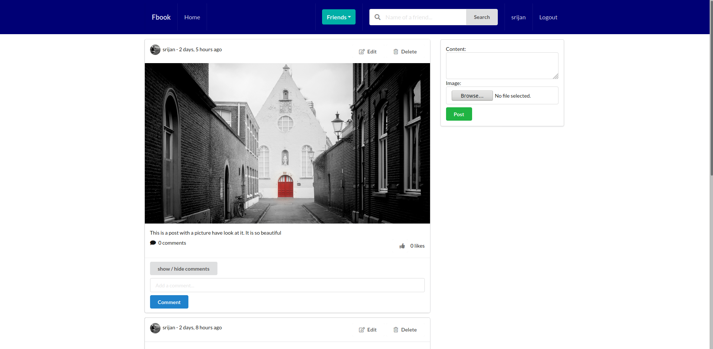
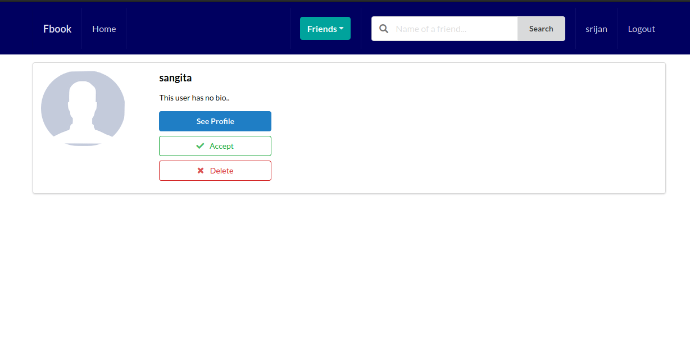
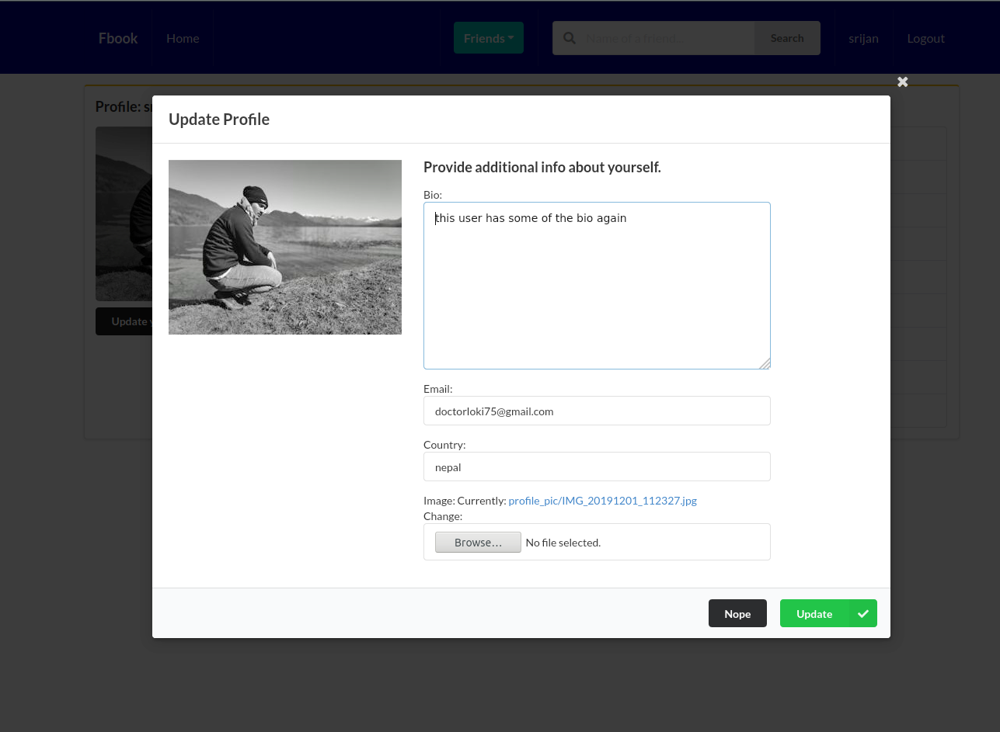

# Django-social-site
This is Django Social site with semantic ui in frontend.
This site was heavly inspired by PYplane Youtube channel

[Link to channel!](https://www.youtube.com/channel/UCQtHyVB4O4Nwy1ff5qQnyRw).


But some of the idea are different like using of generic classes and slug i have done in different approach.

1. Python[Click Me!](https://www.python.org/)
2. Django 3[Click Me!](https://www.djangoproject.com/)
3. Semantic UI [Click me!](https://semantic-ui.com/) (CDN was used)
4. Pillow[Click me!](https://pypi.org/project/Pillow/)
5. Other are in requirement.txt

To install requirement.txt in your system

```
pip install -r requirements.txt
```


Some of the preview of my project:






